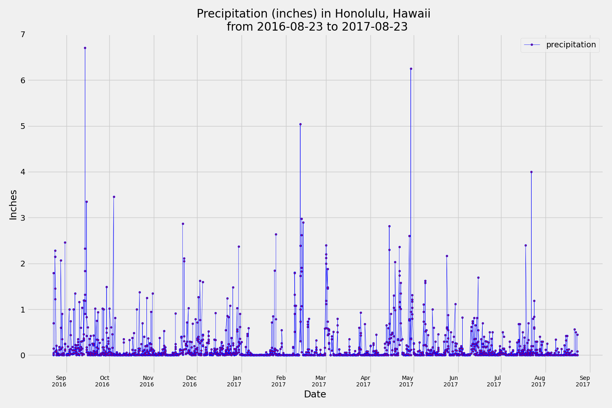
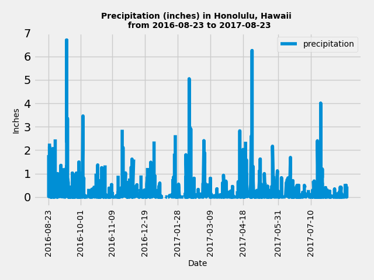
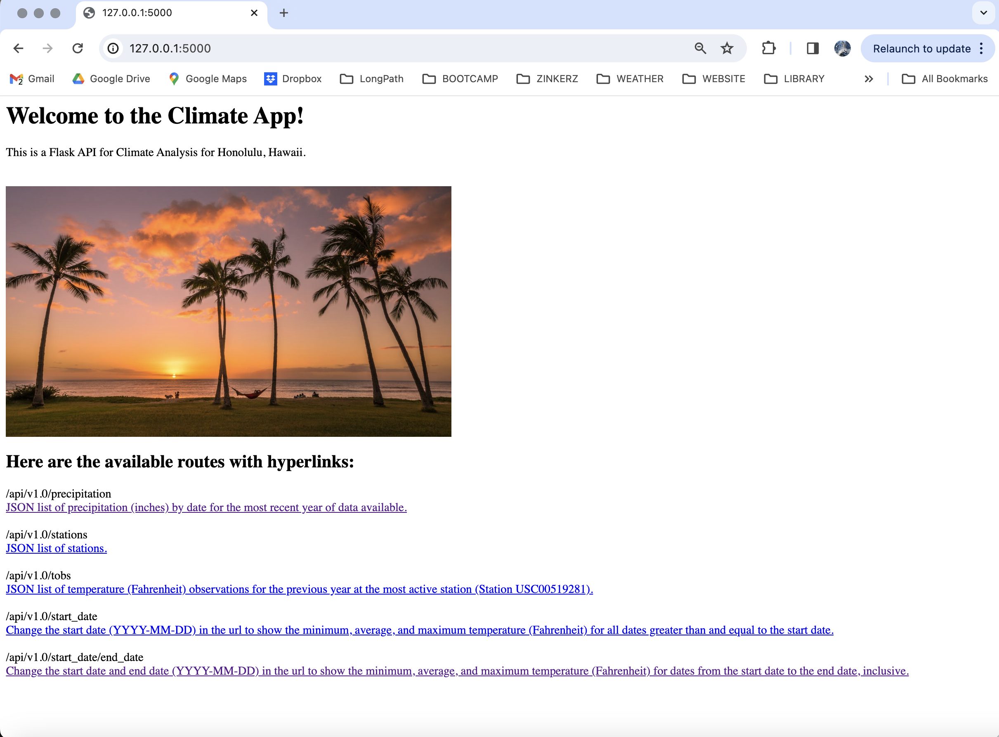
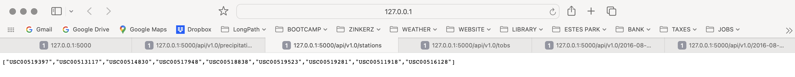
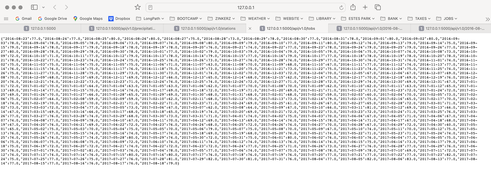
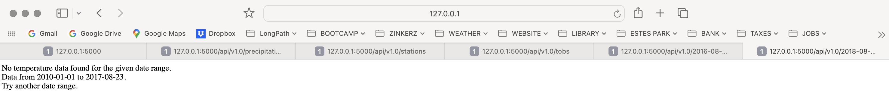

# sqlalchemy-challenge
- Module 10 Challenge
- Steph Abegg

## Regrade Submission

My updated files are in the regrade_submission folder.  I have made changes based on the comments from the grader. Here are the major changes I made:

(1) Rewrote the return logic for the /api/v1.0/'start'/'end' route to be more concise and easier to understand. I agree that my previous code was clunky and had some unnecessary steps.

(2) Cleaned up inconsistent naming of variables in the climate.ipymb (actually, I do not believe there was any inconsistency, but I removed the commented out variables to avoid confusion, which I think is what was causing some appearance of inconsistency between cells).

(3) Added more detail to README.md explaining the purpose of some routes and the analysis methods.

## Files

In the SurfsUp folder, I have included:

(1) [climate.ipynb](regrade_submission/SurfsUp/climate.ipynb). This contains the Part 1: Analyze and Explore the Climate Data analysis. In this section, I used Python and SQLAlchemy to do a basic climate analysis and data exploration of your climate database. Specifically, I used SQLAlchemy ORM queries, Pandas, and Matplotlib. 

(2) Images folder. This folder contains output images from the Part 1 and Part 2 analyses. 

(3) [app.py](regrade_submission/SurfsUp/app.py). This contains the code for Part 2: Design Your Climate App. In this section, I designed a Flask API based on the queries developed in Part 1. When run, the app.py file creates the app at http://127.0.0.1:5000. 

(4) [app.ipynb](regrade_submission/SurfsUp/app.ipynb). This contains the same code as app.py, but in Jupyter notebook form. 

## Part 1: Analyze and Explore the Climate Data

In the Part 1 analysis, we plotted precipitation over time for the last 12 months of data. Two versions of the plot are shown below, in different format (the second matches that in the Module Challenge description, but the first was my own formatting).

In the Part 1 analysis, we also looked at the temperature data at the most active station, which was Station USC00519281, with 2772 measurements over the timeframe of the data.  According to the analysis, the lowest, highest, and average temperature, respectively, at Station USC00519281 are: 54.0, 85.0, 71.7 degrees Fahrenheit. The histogram below shows the temperatures at Station USC00519281 (the station with the most data) for the last 12 months of data.

## Part 2: Design Your Climate App

In this section, I designed a Flask API based on the queries developed in Part 1. When run, the app.py file creates the app at http://127.0.0.1:5000. I made the routes hyperlinks for user convenience and added a nice image at the top. Here's an image of the main page of the working app:

Here is a brief explaination of each route, and the output:

(1) The first route gives a JSON list of precipitation (inches) by date for the most recent year of data available:

(2) The second route gives a JSON list of stations:

(3) The third route gives a JSON list of temperature (Fahrenheit) observations for the previous year at the most active station (Station USC00519281):

(4 and 5) The fourth route shows the minimum, average, and maximum temperature (Fahrenheit) for all dates greater than and equal to the start date. The fifth route shows the minimum, average, and maximum temperature (Fahrenheit) for all dates from the start date to the end date, inclusive. The user can change the start date (YYYY-MM-DD) and end date (YYYY-MM-DD) in the url. An error message is given if the dates are out of range of the data.

## External Resources

Fortunately, we learned almost everything we needed to know to do this assingment in class. For some of the extra things, such as the hyperlinks and image in the app, I used XPert Learning Assistant for help.
