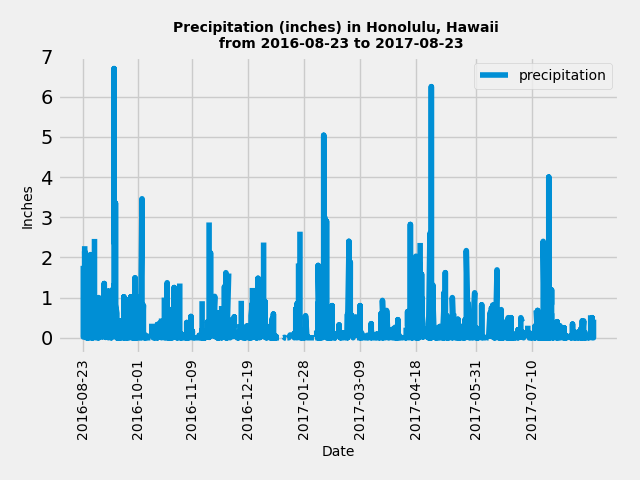
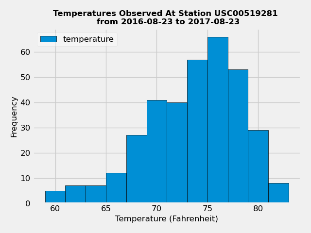
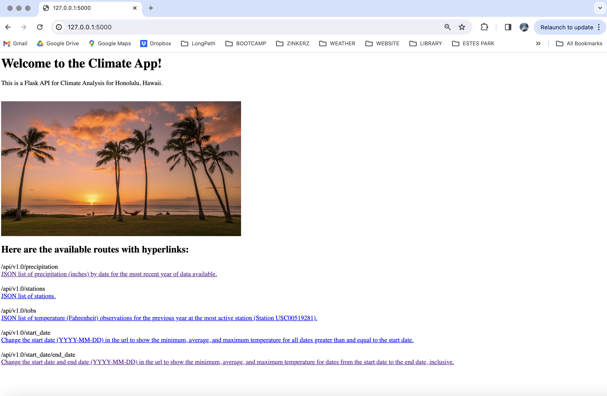
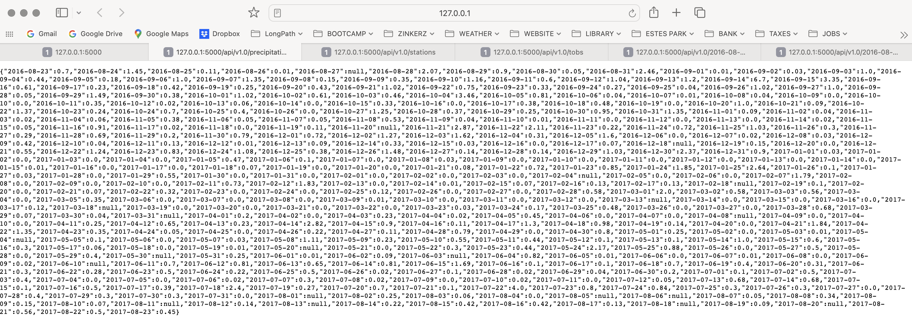
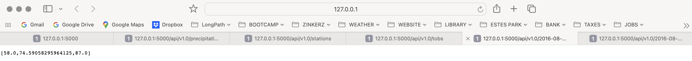

# sqlalchemy-challenge
- Module 10 Challenge
- Steph Abegg

## Files

In the SurfsUp folder, I have included:

(1) [climate.ipynb](SurfsUp/climate.ipynb). This contains the Part 1: Analyze and Explore the Climate Data analysis. In this section, I used Python and SQLAlchemy to do a basic climate analysis and data exploration of your climate database. Specifically, I used SQLAlchemy ORM queries, Pandas, and Matplotlib. 

(2) Images folder. This folder contains output images from the Part 1 and Part 2 analyses. 

(3) [app.py](SurfsUp/app.py). This contains the code for Part 2: Design Your Climate App. In this section, I designed a Flask API based on the queries developed in Part 1. When run, the app.py file creates the app at http://127.0.0.1:5000. 

(4) [app.ipynb](SurfsUp/app.ipynb). This contains the same code as app.py, but in Jupyter notebook form. 

## Part 1: Analyze and Explore the Climate Data

In the Part 1 analysis, we plotted precipitation over time for the last 12 months of data. Two versions of the plot are shown below, in different format (the second matches that in the Module Challenge description, but the first was my own formatting).

In the Part 1 analysis, we also looked at the temperature data at the most active station, which was Station USC00519281, with 2772 measurements over the timeframe of the data.  According to the analysis, the lowest, highest, and average temperature, respectively, at Station USC00519281 are: 54.0, 85.0, 71.7 degrees Fahrenheit. The histogram below shows the temperatures at Station USC00519281 (the station with the most data) for the last 12 months of data.

## Part 2: Design Your Climate App

In this section, I designed a Flask API based on the queries developed in Part 1. When run, the app.py file creates the app at http://127.0.0.1:5000. For the routes including a date in the url, if the date range is out of range of the data, a message will be shown telling the user to enter dates within the range of the data. I also made the routes hyperlinks for user convenience and added a nice image at the top. Here's an image of the main page of the working app:

Here's images of the output generated by clicking each route, respectively:

## External Resources

Fortunately, we learned almost everything we needed to know to do this assingment in class. For some of the extra things, such as the hyperlinks and image in the app, I used XPert Learning Assistant for help.
